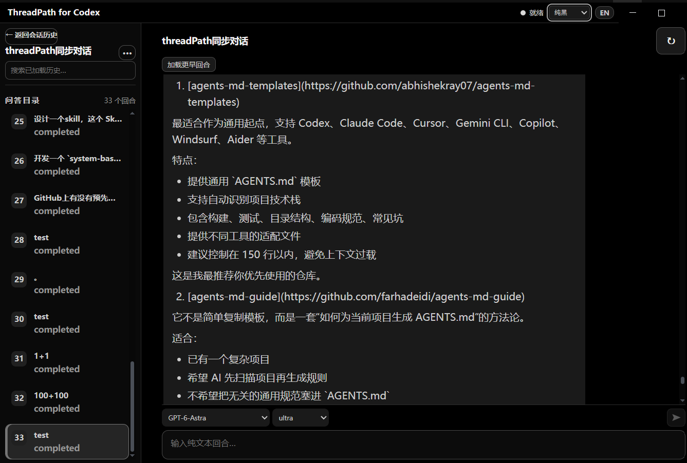
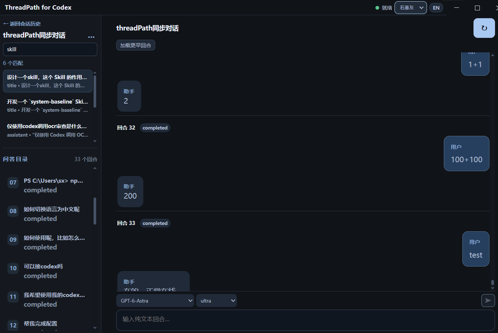
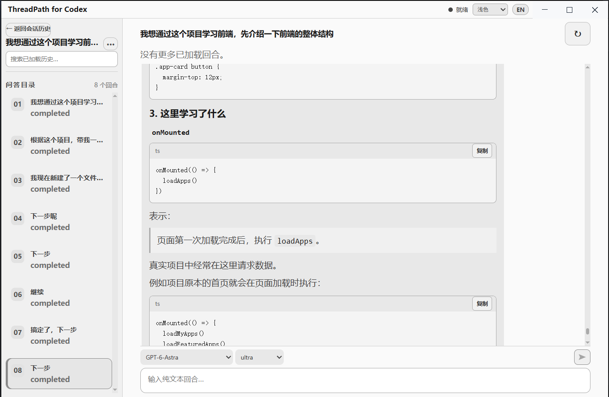

# ThreadPath for Codex

> 与 Codex 官方客户端并行使用的会话历史与工作区管理桌面工具。
> A desktop companion for browsing and organizing Codex history and workspaces alongside the official client.

[](https://github.com/hufangyuan460-blip/threadpath-for-codex)
[](https://github.com/hufangyuan460-blip/threadpath-for-codex/releases/tag/v0.1.0-beta.1)

## 产品定位

ThreadPath 不替代 Codex 官方客户端，而是它的本地历史管理伴侣：在官方客户端中完成日常编码、审批和关键操作；在 ThreadPath 中同步、搜索、浏览和整理会话与工作区。

- 从本地 Codex CLI `app-server` 读取已同步的会话和工作目录；
- 以工作区分组、搜索、收藏、隐藏和本地命名整理历史；
- 提供回合目录、Markdown 阅读、分页与虚拟列表，适合长会话回溯；
- 仅在确认工作目录且服务器确认线程可写时允许发起或续聊，避免与其他客户端争用写入；
- 所有整理偏好保存在 ThreadPath 本地，不修改 Codex 原始会话。

当前为 `v0.1.0-beta.1`。需要已安装并完成认证的 Codex CLI；安装包不包含 CLI、未签名，也暂未提供自动更新。

## 界面预览

**黑色主题**



**石墨灰主题**



**浅色主题**



## 技术栈

- **桌面端：** Electron、Vite、React、TypeScript；
- **会话协议：** Codex CLI `app-server`、stdio、JSONL / JSON-RPC；
- **长会话体验：** `react-virtuoso` 虚拟列表、安全 Markdown 渲染；
- **构建与质量：** pnpm、Node.js 24、NSIS、GitHub Actions、fake app-server E2E。

## 获取与运行

从 [GitHub Releases](https://github.com/hufangyuan460-blip/threadpath-for-codex/releases/tag/v0.1.0-beta.1) 下载最新 Windows 安装包。首次启动时，应用会自动发现已安装的 Codex CLI；找不到时可手动选择 `codex.exe` 与工作目录。

开发环境：

```powershell
pnpm install --frozen-lockfile
pnpm typecheck
pnpm test
pnpm build
pnpm package:win
```

真实协议验证依赖本机登录状态与网络：

```powershell
pnpm smoke
```

## 后续展望

近期优先级是持续提升并行使用时的稳定性、历史同步完整性、性能与无障碍体验。后续将逐步探索更强的工作区与会话管理、树状会话视图、分支比较与 DAG 投影；这些规划不代表当前 Beta 已具备对应功能。

## English

ThreadPath is a local companion to the official Codex client, not a replacement. Use the official client for day-to-day coding and approvals; use ThreadPath to synchronize, search, read, and organize Codex history and workspaces.

It connects to the local Codex CLI `app-server`, keeps workspace organization preferences locally, and allows sending only after a working directory and a writable thread have been confirmed. The current `v0.1.0-beta.1` Windows installer requires an installed and authenticated Codex CLI; it does not bundle the CLI, include code signing, or provide auto-updates yet.

The stack is Electron, Vite, React, TypeScript, the Codex `app-server` over stdio JSONL/JSON-RPC, `react-virtuoso`, pnpm, NSIS, and GitHub Actions. Near-term work focuses on reliability, complete history synchronization, performance, and accessibility before advanced workspace and conversation views.

## License

License terms have not been finalized.
许可证尚未最终确定。
